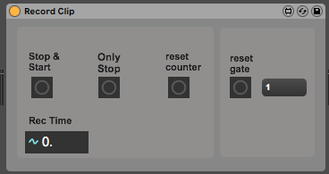

# About
Records a clip into a specific folder.

# Use

 - reset gate: arms the gate (needs to be done twice if used with spectro-ai)
 - reset counter: file counter starts at 0
 - Stop & Start: stops the old recording and starts a new one 
 - Only Stop: stops recording
 - Rec time: shows the current recording time

# Important

Currently, the device is fix to track1, the folder is also fixed and must be changed to the user's preference. 
